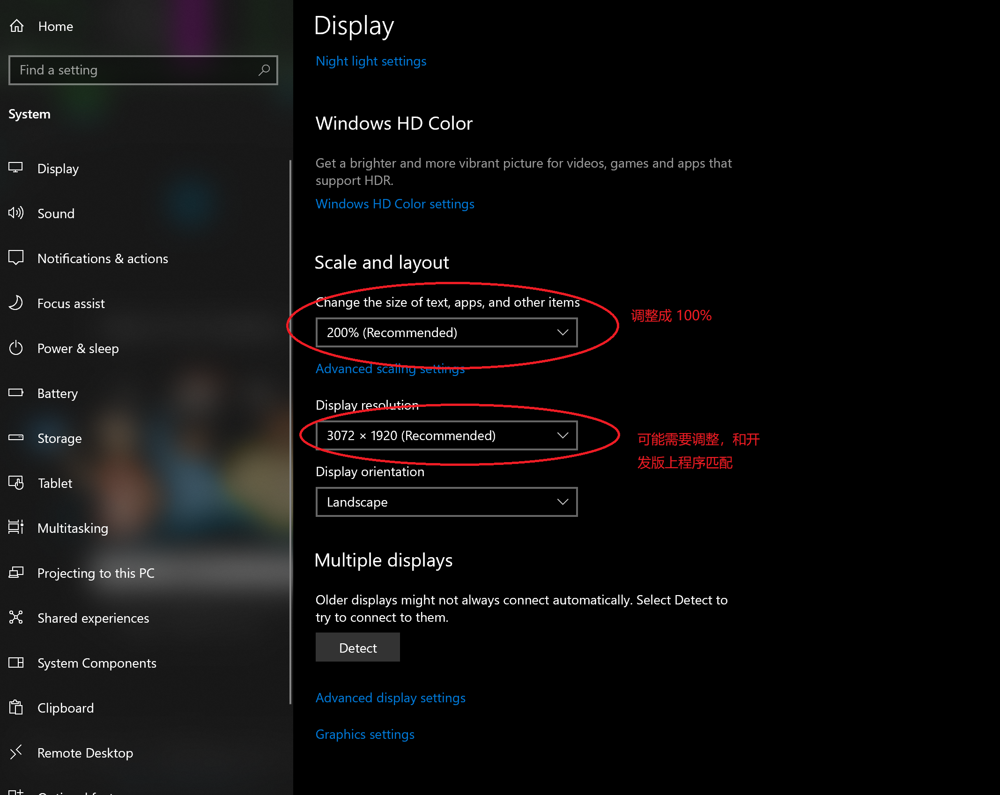

# 演示方法

1. 调整计算机分辨率和缩放比例，具体参见下图
    
2. 关闭杀毒软件，设置鼠标指针大小为较大（看的更清楚），调整电源计划（避免计算机自动熄屏）
3. 接上视频采集卡
4. 从 [Release页面](https://github.com/richardzone/eye-tracker-app-csharp/releases) 下载 `x64-Release.zip`
5. 解压并运行其中的 `eye_tracker_app_csharp.exe`

## 无视频演示卡测试方法

1. 执行上面1和2步骤
2. 下载模拟摄像头软件例如 [WeCam](https://www.e2esoft.cn/wecam/)
3. 将虚拟摄像头设为播放视频，视频在[这里](docs/test_arcode_video.mp4)
4. 执行上面的4和5步骤